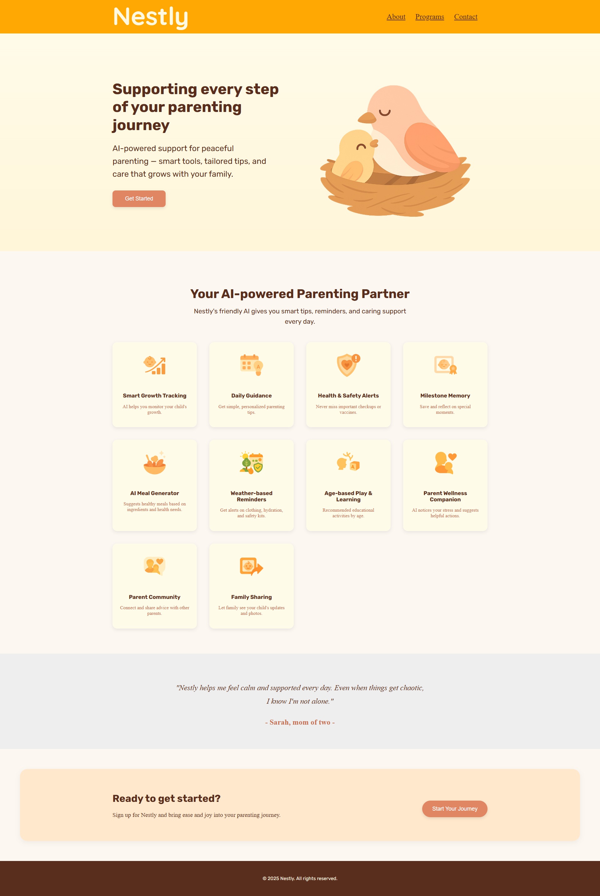

# Nestly Landing Page

This is a warm and simple landing page I made as part of the [Odin Project](https://www.theodinproject.com/) Foundations course.

Instead of following the example exactly, I came up with my own idea for the design, layout, and style.  
I wanted to make something soft and friendly that could be used by new parents.

---

## Features

- Clean, responsive layout using Flexbox and Grid
- Soft color palette and rounded design
- Custom icons and section layout
- Simple structure: Hero → Features → Quote → CTA → Footer

---

## What I Learned

- How the `.container` class works across sections and keeps content aligned
- How to use `flex-direction`, `flex-wrap`, `gap`, `justify-content`, and `align-items` to arrange elements
- Button alignment and spacing (especially inside the CTA section)
- How to group and organize styles section-by-section
- How to use Git commit messages clearly using Conventional Commit rules
- Most of all, I got more comfortable with writing HTML and CSS by practicing and trying different ideas

---

## File Structure

```plaintext
landing-page/
├── index.html
├── style.css
├── img/
│ ├── feature-icon/
│ ├── nestly-logo.png
│ ├── logo-birds.png
│ ├── Nestly-landing-page.png
│ └── screenshots/
│ └── desktop-view.png
├── README.md
```

## 📸 Screenshot



```
## Future Improvements

- **Try adding some simple JavaScript**
  I'm just starting to learn JavaScript, so I'd like to come back and add small interactive features like:
  - Smooth scrolling when clicking the CTA button
  - Maybe show/hide some extra content
  - Simple button effects or hover interactions

- **Add dark mode toggle**
  I'd like to learn how to add a button that lets users switch between light and dark themes.

- **Make it even better on mobile**
  I want to fine-tune the spacing and layout to look nicer on smaller screens.

- **Improve accessibility**
  In the future, I'll look into how to make the site easier to use with screen readers or keyboard navigation.

- **Clean up the CSS more**
  I might organize the CSS better using variables or utility classes when I get more comfortable.
```
